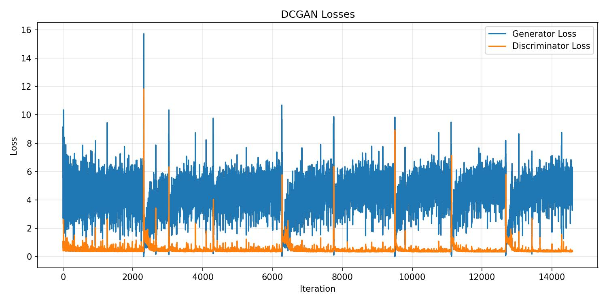
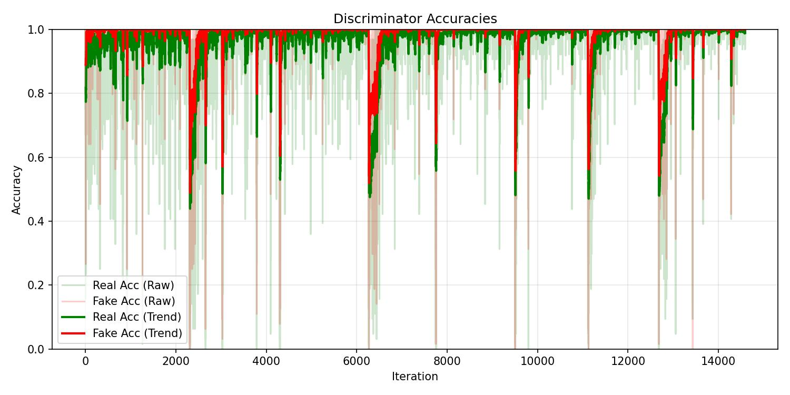
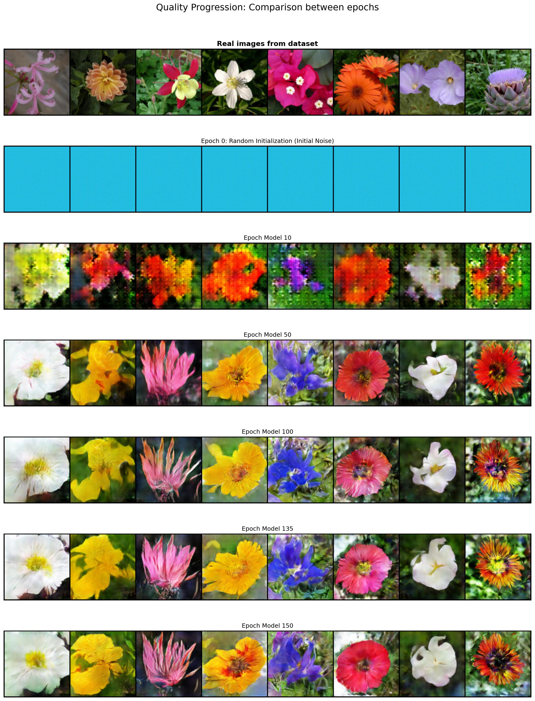
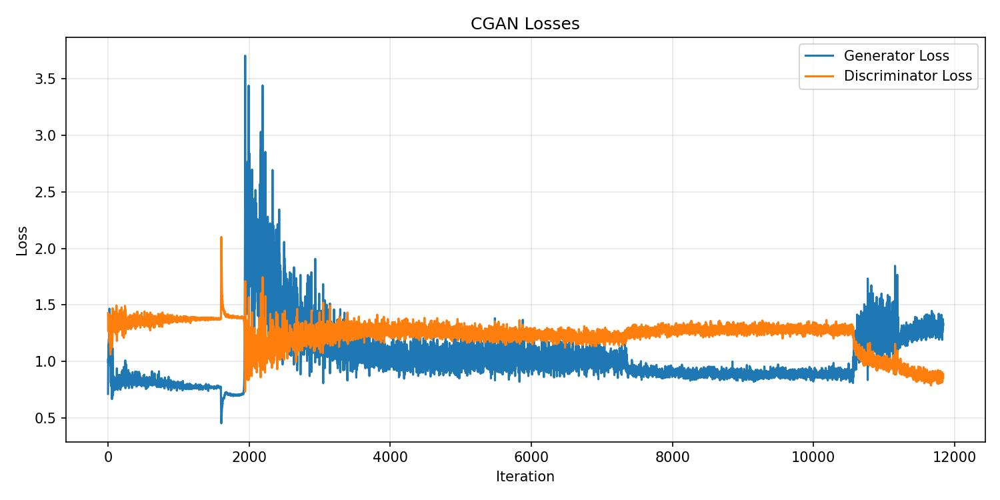
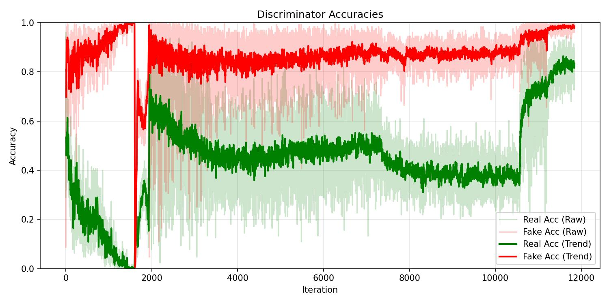
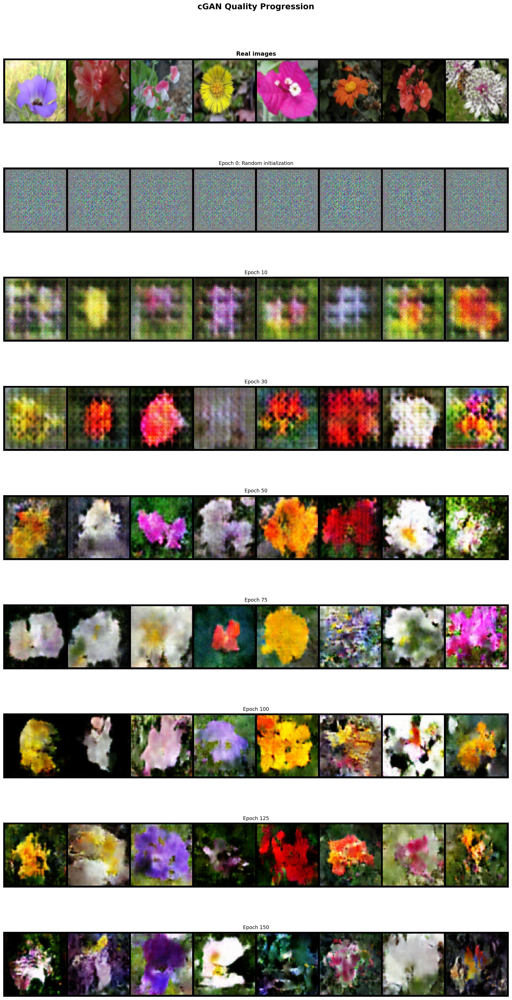
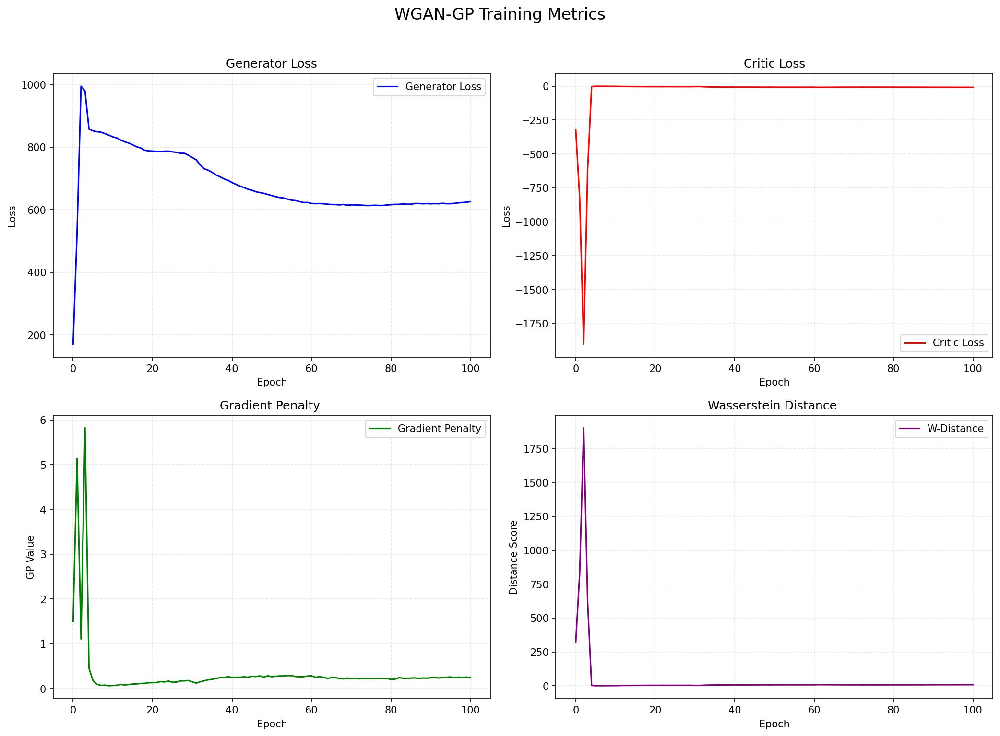
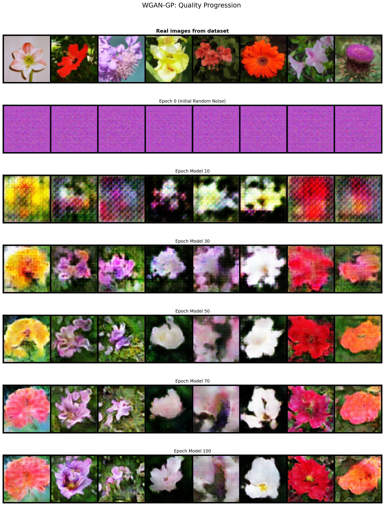
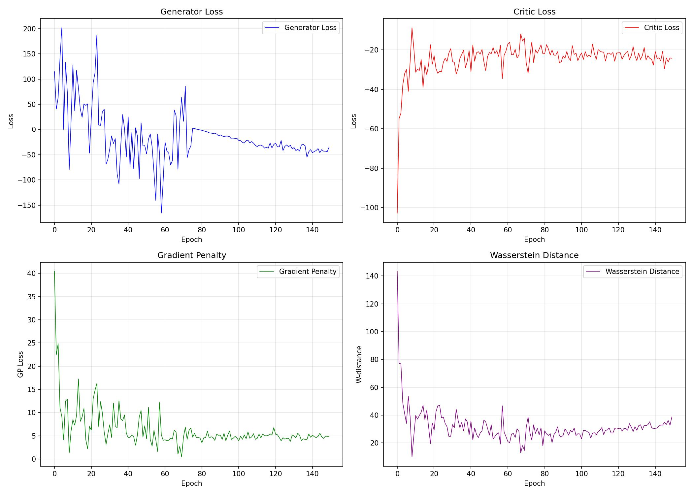
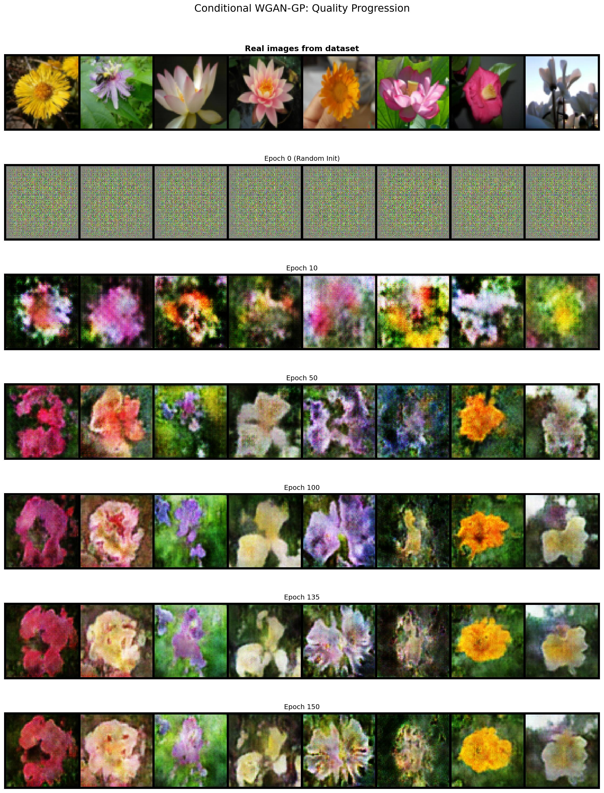

# 🌸 GAN Architectures on Oxford Flowers 102

> Implementation and comparison of **DCGAN**, **CGAN**, **WGAN-GP** and **WCGAN-GP** for unconditional and conditional flower image generation.

**Dataset:** [Oxford Flowers 102](https://www.robots.ox.ac.uk/~vgg/data/flowers/102/) · **Framework:** PyTorch · **Platform:** Google Colab

---

## 📋 Table of Contents

- [Overview](#overview)
- [Models](#models)
- [Repository Structure](#repository-structure)
- [Hyperparameters](#hyperparameters)
- [Results](#results)
  - [DCGAN](#1-dcgan--unconditional)
  - [CGAN](#2-cgan--conditional)
  - [WGAN-GP](#3-wgan-gp--unconditional)
  - [WCGAN-GP](#4-wcgan-gp--conditional)
- [Comparative Discussion](#comparative-discussion)
- [How to Run](#how-to-run)

---

## Overview

This project trains four GAN variants from scratch on the **Oxford Flowers 102** dataset (~8,000 images across 102 flower categories). The goal is to understand how architectural choices and loss formulations affect generative performance, both for unconditional and class-conditional image synthesis.

| Model | Type | Resolution | Loss | Conditioning |
|---|---|---|---|---|
| DCGAN | Unconditional | 128×128 | BCE | ✗ |
| CGAN | Conditional | 64×64 | BCE | ✓ (102 classes) |
| WGAN-GP | Unconditional | 64×64 | Wasserstein + GP | ✗ |
| WCGAN-GP | Conditional | 64×64 | Wasserstein + GP | ✓ (102 classes) |

---

## Models

### DCGAN
A Deep Convolutional GAN following the guidelines of [Radford et al., 2015](https://arxiv.org/abs/1511.06434). The Generator uses transposed convolutions with BatchNorm and ReLU; the Discriminator uses strided convolutions with LeakyReLU. One-sided label smoothing (real=0.9) improves stability.

### CGAN
Extends DCGAN with class conditioning ([Mirza & Osindero, 2014](https://arxiv.org/abs/1411.1784)). Class labels are embedded via `nn.Embedding(102, 50)` and concatenated with the latent vector in G, and with the feature map in D. The Discriminator uses **spectral normalisation** and **Dropout(0.3)** for additional regularisation.

### WGAN-GP
Replaces BCE with the Wasserstein-1 distance ([Arjovsky et al., 2017](https://arxiv.org/abs/1701.07875)) and enforces the Lipschitz constraint via a **gradient penalty** on interpolated samples ([Gulrajani et al., 2017](https://arxiv.org/abs/1704.00028)). The Critic uses `InstanceNorm2d` (instead of BatchNorm) and is updated **5 times** per generator step.

### WCGAN-GP
Combines class conditioning (CGAN) with the Wasserstein-GP objective. Both the Conditional Generator and Conditional Critic receive label embeddings. The gradient penalty is computed on class-conditioned interpolated samples. A lower critic learning rate (5e-5) ensures balanced training.

---

## Repository Structure

```
gan-architectures-flowers102/
│
├── notebooks/
│   ├── DCGAN.ipynb          # Ex.1 — Unconditional DCGAN
│   ├── CGAN.ipynb           # Ex.2 — Conditional GAN
│   ├── WGAN_GP.ipynb        # Ex.3 — Wasserstein GAN-GP
│   └── WCGAN_GP.ipynb       # Ex.4 — Conditional WGAN-GP
│
├── images/
│   ├── dcgan/
│   │   ├── losses.jpg
│   │   ├── accuracies.jpg
│   │   └── evolution.jpg
│   ├── cgan/
│   │   ├── losses.jpg
│   │   ├── accuracies.jpg
│   │   └── evolution.jpg
│   ├── wgan/
│   │   ├── losses.jpg
│   │   └── evolution.jpg
│   └── wcgan/
│       ├── losses.jpg
│       └── evolution.jpg
│
├── report/
│   └── GAN_Report_HW1.docx  # Full written report
│
└── README.md
```

---

## Hyperparameters

| Parameter | DCGAN | CGAN | WGAN-GP | WCGAN-GP |
|---|---|---|---|---|
| Latent dim | 100 | 100 | 100 | 100 |
| Resolution | 128×128 | 64×64 | 64×64 | 64×64 |
| Batch size | 64 | 128 | 128 | 128 |
| LR (G) | 2e-4 | 2e-4 | 2e-4 | 2e-4 |
| LR (D/C) | 1e-4 | 1e-4 | 1e-4 | 5e-5 |
| β₁ / β₂ | 0.5 / 0.999 | 0.5 / 0.999 | 0.5 / 0.999 | 0.5 / 0.999 |
| Epochs | 150 | 150 | 100 | 150 |
| Loss | BCE | BCE | Wasserstein | Wasserstein |
| λ (GP) | — | — | 10 | 10 |
| n\_critic | — | — | 5 | 5 |
| Embedding dim | — | 50 | — | 50 |
| Num classes | — | 102 | — | 102 |
| D normalisation | BatchNorm | SpectralNorm | InstanceNorm | InstanceNorm |

---

## Results

### 1. DCGAN — Unconditional

**Loss curves & Discriminator accuracy**




**Visual progression** (epoch 0 → 150, fixed latent vector)



> From pure noise at epoch 0 to structured flower images with visible petals, textures and colour gradients by epoch 150. The discriminator accuracy on real/fake samples converges toward ~0.5, indicating a balanced adversarial equilibrium.

---

### 2. CGAN — Conditional

**Loss curves & Discriminator accuracy**




**Visual progression** (epoch 0 → 150, fixed z + fixed class labels)



> Class-consistent attributes emerge by epoch 50–75. By epoch 150, generated images exhibit class-specific petal shapes, colours and spatial arrangements. Spectral normalisation prevents discriminator dominance.

---

### 3. WGAN-GP — Unconditional

**Loss & Gradient Penalty curves**



**Visual progression** (epoch 0 → 100, fixed latent vector)



> The Wasserstein distance provides a stable, interpretable training signal. Mode collapse is absent across the 25 fixed-z samples. Sharper images with fewer artefacts compared to DCGAN at equivalent training steps.

---

### 4. WCGAN-GP — Conditional

**Loss & Gradient Penalty curves**



**Visual progression** (epoch 0 → 150, fixed z + fixed class labels)



> The most stable conditional model. Class-specific generation is reliable across all 102 categories by epoch 100+. The lower critic LR (5e-5) prevents the critic from overfitting to real samples early in training.

---

## Comparative Discussion

| Aspect | DCGAN | CGAN | WGAN-GP | WCGAN-GP |
|---|---|---|---|---|
| Training stability | Medium | Low–Medium | High | High |
| Image quality | Good (128px) | Good | Very good | Very good |
| Mode collapse risk | Medium | Medium | Low | Low |
| Class control | ✗ | ✓ | ✗ | ✓ |
| Interpretable loss | ✗ | ✗ | ✓ (W-dist) | ✓ (W-dist) |

**Key takeaways:**
- BCE-based models (DCGAN, CGAN) are simpler but prone to vanishing gradients when the discriminator becomes too confident.
- WGAN-GP models provide more meaningful gradient signals and recover more gracefully from suboptimal initialisation.
- Conditioning on 102 classes adds significant complexity; WCGAN-GP handles it most reliably thanks to the Wasserstein objective.
- The DCGAN at 128×128 achieves the highest resolution but requires more careful tuning.

---

## How to Run

All notebooks are designed for **Google Colab** with GPU acceleration.

1. Open the desired notebook from the `notebooks/` folder in Colab.
2. Mount your Google Drive to persist checkpoints:
   ```python
   from google.colab import drive
   drive.mount('/content/drive')
   ```
3. The dataset is loaded automatically via `torchvision.datasets.Flowers102`.
4. Set your Drive path in the `DRIVE_PATH` variable and run all cells.

**Requirements** (automatically available on Colab):
```
torch torchvision matplotlib numpy
```

---

## References

- Goodfellow et al. (2014) — [Generative Adversarial Networks](https://arxiv.org/abs/1406.2661)
- Radford et al. (2015) — [DCGAN](https://arxiv.org/abs/1511.06434)
- Mirza & Osindero (2014) — [Conditional GAN](https://arxiv.org/abs/1411.1784)
- Arjovsky et al. (2017) — [Wasserstein GAN](https://arxiv.org/abs/1701.07875)
- Gulrajani et al. (2017) — [Improved Training of WGANs](https://arxiv.org/abs/1704.00028)
- Nilsback & Zisserman (2008) — [Oxford Flowers 102](https://www.robots.ox.ac.uk/~vgg/data/flowers/102/)

---

*Politecnico di Torino — Generative AI for Graphics and Multimedia (01VRWOV/01VRWYG) — A.A. 2025/26*
